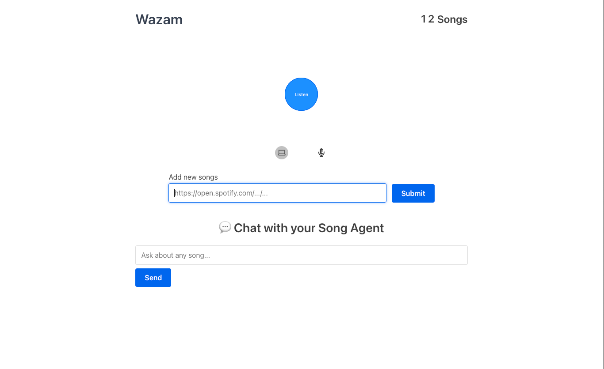
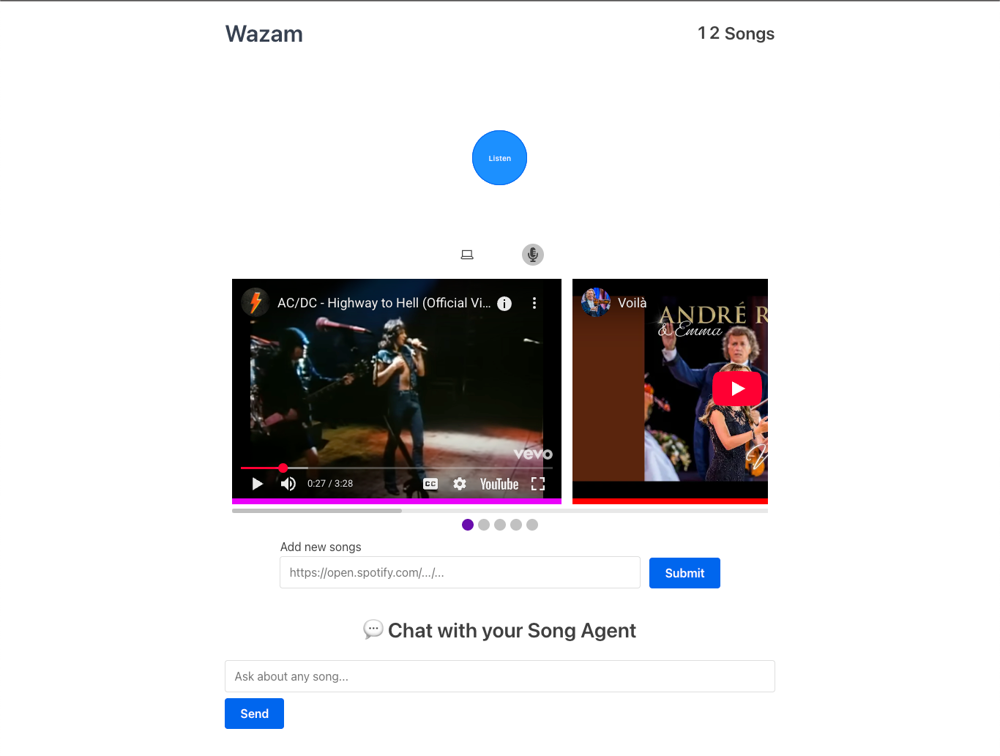

# SEEK-TUNE
AI-powered music discovery platform that identifies songs from short audio snippets using
Shazam-style audio fingerprinting and delivers conversational, personalized recommendations.

## Overview
Seek-Tune is a full-stack system that combines **in-browser audio fingerprinting**, a **high-performance Go backend**, and a **conversational recommendation agent** to enable fast, privacy-preserving music discovery.

Key characteristics:
- Identifies songs from short, noisy audio clips
- Performs fingerprinting entirely client-side (no raw audio upload)
- Supports real-time matching, downloads, and recommendations
- Fully containerized with Docker Compose for reproducible deployment

## Core Features

- **Shazam-style audio fingerprinting** using spectral peak hashing
- **WebAssembly DSP** running directly in the browser
- **Go backend** for fast hash-based matching and media handling
- **React frontend** for recording, matching, and result exploration
- **Conversational AI agent** for follow-up queries and recommendations
- **Real-time updates** via WebSockets
- **Privacy-first design** (fingerprints only, no waveform storage)

## System Design (High Level)

The system is composed of four cooperating layers:

- **Client layer**: React UI, in-browser FFmpeg preprocessing, WASM fingerprint generation  
- **Matching layer**: Go service for fingerprint lookup, scoring, and metadata retrieval  
- **Recommendation layer**: Mastra Agent providing conversational, tool-driven suggestions  
- **Infrastructure layer**: Docker Compose orchestrating all services and networking  

Each layer is independently deployable but designed to run as a single integrated stack.

## Audio Fingerprinting Pipeline

- User records ~20 seconds of audio in the browser
- Audio is converted to mono and resampled to 44.1 kHz using FFmpeg (client-side)
- A WebAssembly module extracts spectral peaks across time
- Peaks are encoded as compact `(hash, time-offset)` pairs
- Fingerprints are sent to the backend for matching
- Backend scores matches using time-alignment consistency
- Top matches are returned with song metadata

This approach is fast, noise-tolerant, and memory-efficient.

## Backend (Go)

The Go backend is responsible for:

- Fingerprint storage and hash-based matching
- Ranking matches using temporal alignment
- Managing song metadata and media files
- Handling downloads and WAV generation
- Streaming real-time updates via WebSockets

Storage is backed by:
- SQLite for metadata
- On-disk fingerprint and media storage

The production container bundles FFmpeg and yt-dlp for media processing.

## Frontend (React)

The frontend provides:

- Audio capture directly from the browser
- In-browser audio preprocessing using FFmpeg
- Local fingerprint generation via WASM
- Match result visualization with previews
- Real-time status updates via Socket.IO
- Integrated chat interface for recommendations

All fingerprinting occurs locally, ensuring user audio never leaves the device.

## Conversational Recommendation Agent

The Mastra Agent enables natural-language interaction and intelligent music discovery.

Capabilities include:
- Follow-up recommendations (“find similar songs”)
- Artist and genre exploration
- Context-aware responses using tool-based reasoning

The agent runs as an independent service and can be extended with external APIs
such as Spotify for richer metadata and personalization.

## Why This Project Is Technically Interesting

- **In-browser DSP with WebAssembly**  
  Heavy audio processing runs client-side, reducing server load and preserving privacy.

- **Shazam-style fingerprinting at scale**  
  Uses sparse spectral hashes instead of raw audio, enabling fast matching and low storage overhead.

- **Cross-language system design**  
  Integrates WASM, Go, React, and Node-based agents into a cohesive architecture.

- **Latency-aware design**  
  Real-time WebSocket updates and local preprocessing minimize end-to-end response time.

- **Production-minded deployment**  
  Fully containerized stack with reproducible builds and isolated services.

## Deployment

The entire stack is managed with Docker Compose.

## Build and start all services:

```bash
docker compose up --build
```
Start without rebuilding:
```markdown
docker compose up
```
Stop and clean up:

```markdown
docker compose down
```
Services communicate over an internal Docker network using environment configuration.


## Development Notes
- Frontend uses REACT_APP_BACKEND_URL for backend connectivity
- The WASM file must be served at /main.wasm
- Fingerprinting function must be globally exposed to the browser
- Mastra Agent runs with npm run dev
- Dependency issues can often be resolved with a clean npm ci


## Future Enhancements
- Can add the humming to search feature, need to check it out
- Emotion and mood-based recommendations
- Collaborative filtering for playlist generation

References
 - Legacy foundation by Chigozirim
 - Reference video: https://www.youtube.com/watch?v=a0CVCcb0RJM
 - Github repo: https://github.com/cgzirim/seek-tune
 - Technical deep dive for nerds: https://drive.google.com/file/d/1ahyCTXBAZiuni6RTzHzLoOwwfTRFaU-C/view



